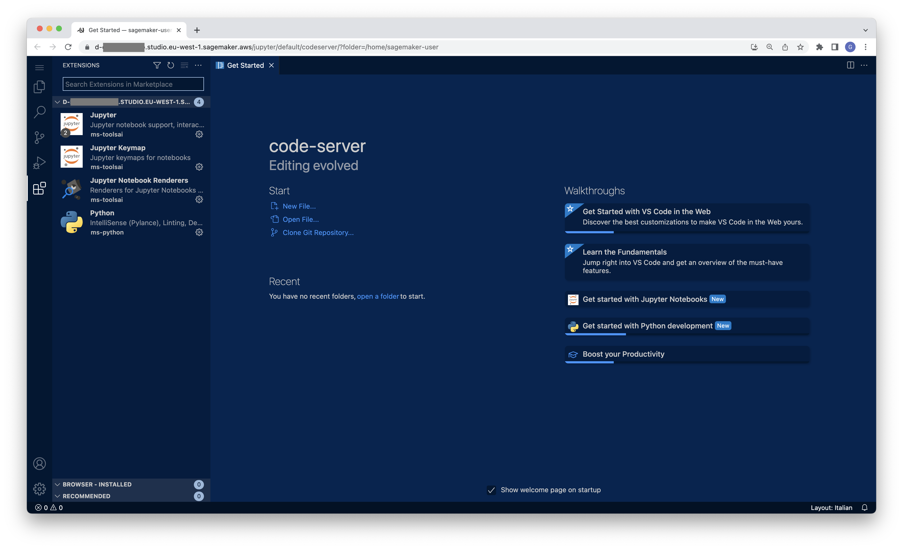
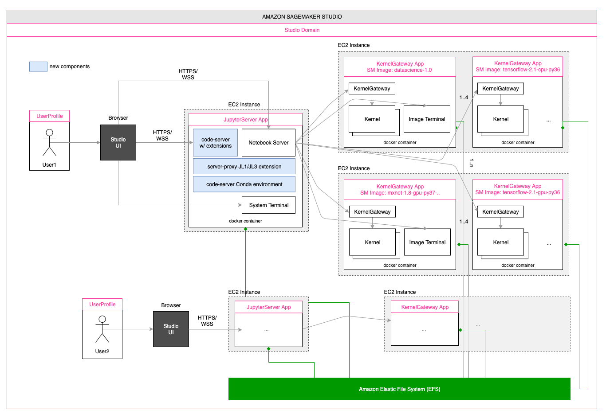
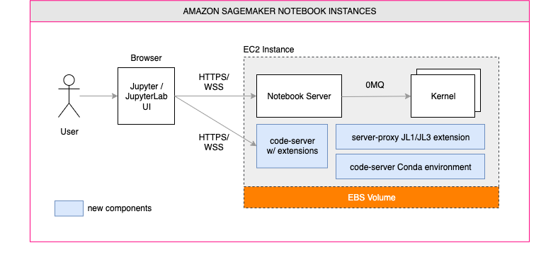

# code-server on Amazon SageMaker

A solution to install and run [code-server](https://github.com/coder/code-server) on Amazon SageMaker, and access it from the browser to develop and test your ML models.

## Highlights

This solution works for both [Amazon SageMaker Studio](https://docs.aws.amazon.com/sagemaker/latest/dg/studio.html) and [Amazon SageMaker Notebook Instances](https://docs.aws.amazon.com/sagemaker/latest/dg/nbi.html) configured to run with both JupyterLab 3 (recommended) and JupyterLab 1. For additional information on compatibility, please check the [compatiblity matrix](#compatibility).

### Features - Amazon SageMaker Studio

- Access code-server from the Amazon SageMaker Studio launcher
- Automatically create a dedicated Conda environment
- Automatically install MS Python extension
- Use a custom extension gallery

### Features - Amazon SageMaker Notebook Instances
- Access code-server from both the JupyterLab launcher and the Jupyter notebook File menu
- Automatically create a dedicated Conda environment
- Run with diverse instance types (CPU/GPU)
- Automatically install MS Python extension
- Automatically install Docker extension
- Use a custom extension gallery
- Persistent installation (no need to re-install when Notebook Instances are stopped and re-started)

### Screenshots

<table style="{border: none; text-align: center;}" width="70%">
    <tr>
        <td colspan="2"></td>
    </tr>
    <tr>
        <td></td>
        <td></td>
    </tr>
    <tr>
        <td></td>
        <td></td>
    </tr>
</table>

## Getting Started

There are two ways to get started and install the solution in Amazon SageMaker:

1. **[Recommended]** Using lifecycle configuration scripts that will install code-server automatically when SageMaker Studio or Notebook Instances are spin-up.
2. Install code-server manually from the Jupyter system terminal

In both cases we are going to leverage on the following install scripts:
- SageMaker Studio: [install-codeserver](install-scripts/studio/install-codeserver.sh)
- SageMaker Notebook Instances: [install-codeserver](install-scripts/notebook-instances/install-codeserver.sh) and [setup-codeserver](install-scripts/notebook-instances/setup-codeserver.sh) (install procedure is split in two sequential steps to better support lifecycle configurations - see next sections).

The install procedure is based on the latest stable release of the solution as of today.

### Install with Lifecycle Configurations

#### Amazon SageMaker Studio

When using Amazon SageMaker Studio, code-server must be installed on the instance that runs the JupyterServer application. For further information on the Studio architecture, please refer to [this](https://aws.amazon.com/blogs/machine-learning/dive-deep-into-amazon-sagemaker-studio-notebook-architecture/) blog post. By using [Studio lifecycle configurations](https://docs.aws.amazon.com/sagemaker/latest/dg/studio-lcc.html), we can make sure code-server is installed automatically when the JupyterServer application is spin-up, and enable this behavior by default either for all users in the Studio domain or for a specific Studio user profile.

**Example: install code-server automatically for all users in the Studio domain**

From a terminal appropriately configured with AWS CLI, run the following commands:
	
    curl -LO https://github.com/aws-samples/amazon-sagemaker-codeserver/releases/download/v0.1.5/amazon-sagemaker-codeserver-0.1.5.tar.gz
	tar -xvzf amazon-sagemaker-codeserver-0.1.5.tar.gz

    cd amazon-sagemaker-codeserver/install-scripts/studio

    LCC_CONTENT=`openssl base64 -A -in install-codeserver.sh`

    aws sagemaker create-studio-lifecycle-config \
        --studio-lifecycle-config-name install-codeserver-on-jupyterserver \
        --studio-lifecycle-config-content $LCC_CONTENT \
        --studio-lifecycle-config-app-type JupyterServer \
        --query 'StudioLifecycleConfigArn'

    aws sagemaker update-domain \
        --region <your_region> \
        --domain-id <your_domain_id> \
        --default-user-settings \
        '{
        "JupyterServerAppSettings": {
        "DefaultResourceSpec": {
        "LifecycleConfigArn": "arn:aws:sagemaker:<your_region>:<your_account_id>:studio-lifecycle-config/install-codeserver-on-jupyterserver",
        "InstanceType": "system"
        },
        "LifecycleConfigArns": [
        "arn:aws:sagemaker:<your_region>:<your_account_id>:studio-lifecycle-config/install-codeserver-on-jupyterserver"
        ]
        }}'

Make sure to replace <your_domain_id>, <your_region> and <your_account_id> in the previous commands with the Studio domain ID, the AWS region and AWS Account ID you are using respectively.

#### Amazon SageMaker Notebook Instances

Amazon SageMaker Notebook Instances support lifecycle configuration scripts that run when the instance is created and when the instance is started (re-run also at restart after the instance is stopped). As a consequence, we can make sure to install code-server once when the instance is created, and setup it on start. For more information on lifecycle configurations please check the [SageMaker Notebook Instances lifecycle configurations](https://docs.aws.amazon.com/sagemaker/latest/dg/notebook-lifecycle-config.html) documentation.

**Example: Create a notebook instance and install code-server automatically**

From a terminal appropriately configured with AWS CLI, run the following commands:

    curl -LO https://github.com/aws-samples/amazon-sagemaker-codeserver/releases/download/v0.1.5/amazon-sagemaker-codeserver-0.1.5.tar.gz
	tar -xvzf amazon-sagemaker-codeserver-0.1.5.tar.gz

    cd amazon-sagemaker-codeserver/install-scripts/notebook-instances

    aws sagemaker create-notebook-instance-lifecycle-config \
        --notebook-instance-lifecycle-config-name install-codeserver \
        --on-start Content=$((cat setup-codeserver.sh || echo "")| base64) \
        --on-create Content=$((cat install-codeserver.sh || echo "")| base64)

    aws sagemaker create-notebook-instance \
        --notebook-instance-name <your_notebook_instance_name> \
        --instance-type <your_instance_type> \
        --role-arn <your_role_arn> \
        --lifecycle-config-name install-codeserver

Make sure to replace <your_notebook_instance_name>, <your_instance_type> and <your_role_arn> in the previous commands with the appropriate values.

### Install manually

#### Amazon SageMaker Studio

1. Open the Amazon SageMaker Studio system terminal
2. From the terminal, run the following commands:

        curl -LO https://github.com/aws-samples/amazon-sagemaker-codeserver/releases/download/v0.1.5/amazon-sagemaker-codeserver-0.1.5.tar.gz
		tar -xvzf amazon-sagemaker-codeserver-0.1.5.tar.gz

        cd amazon-sagemaker-codeserver/install-scripts/studio
        
        chmod +x install-codeserver.sh
        ./install-codeserver.sh

        # Note: when installing on JL1, please prepend the nohup command to the install command above and run as follows: 
        # nohup ./install-codeserver.sh

#### Amazon SageMaker Notebook Instances

1. Access JupyterLab and open a terminal
2. From the terminal run the following commands:

        curl -LO https://github.com/aws-samples/amazon-sagemaker-codeserver/releases/download/v0.1.5/amazon-sagemaker-codeserver-0.1.5.tar.gz
        tar -xvzf amazon-sagemaker-codeserver-0.1.5.tar.gz

        cd amazon-sagemaker-codeserver/install-scripts/notebook-instances
        
        chmod +x install-codeserver.sh
        chmod +x setup-codeserver.sh
        sudo ./install-codeserver.sh
        sudo ./setup-codeserver.sh

3. \[Optional\] - After a stop/restart operation, run the following command to re-configure code-server:

        sudo ./setup-codeserver.sh

## Advanced configuration
The install scripts define the following variables that can be modified to customize the install procedure.

- **CODE_SERVER_VERSION** - The version of code-server to install. The solution is tested with version 4.5.2. For a list of the available releases, please check https://github.com/coder/code-server/releases
- **CODE_SERVER_INSTALL_LOC** - The install location for code-server. For notebook instance setup, please make sure to choose a path on the attached EBS volume (under /home/ec2-user/SageMaker/).
- **XDG_DATA_HOME** - The directory where user-specific code-server data is stored. 
- **XDG_CONFIG_HOME** - The directory where user-specific code-server config is stored.
- **INSTALL_PYTHON_EXTENSION** - Set to 1 if the _ms-python.python_ extension must be installed; 0 otherwise.
- **CREATE_NEW_CONDA_ENV** - Set to 1 if a new Conda environment must be created, 0 otherwise. This environment is supposed to be used when developing with code-server, to avoid conflicting with existing Conda environments in Studio or Notebook Instances.
- **CONDA_ENV_LOCATION** - The location where the Conda environment will be created. Applies only when **CREATE_NEW_CONDA_ENV** is set to 1.
- **CONDA_ENV_PYTHON_VERSION** - The version of Python to install in the new Conda environment. Applies only when **CREATE_NEW_CONDA_ENV** is set to 1.
- **INSTALL_DOCKER_EXTENSION** - Set to 1 if the _ms-azuretools.vscode-docker_ extension must be installed; 0 otherwise. Applies only to Notebook Instances.
- **USE_CUSTOM_EXTENSION_GALLERY** - Set to 1 if using a custom extension gallery for code-server, 0 otherwise. A custom extension gallery must adhere to the Extension Gallery API schema. Additional info: https://coder.com/docs/code-server/latest/FAQ#how-do-i-use-my-own-extensions-marketplace
- **EXTENSION_GALLERY_CONFIG** - The API configuration for using a custom extension gallery. Applies only when **USE_CUSTOM_EXTENSION_GALLERY** is set to 1.
- **LAUNCHER_ENTRY_TITLE** - The label of the button added to the JupyterLab launcher. Defaults to 'Code Server'.
- **PROXY_PATH** - The path that is appended to the Jupyter URI to access code-server. Defaults to 'codeserver'. Changing this value will cause the code-server icon not being used, and falling-back to a generic icon.
- **LAB_3_EXTENSION_DOWNLOAD_URL** - The download URL of the JupyterLab 3 extension.
- **INSTALL_LAB1_EXTENSION** - Set to 1 if the JupyterLab 1 extension must be installed, 0 otherwise.
- **LAB_1_EXTENSION_DOWNLOAD_URL** - The download URL of the JupyterLab 1 extension.

## Architecture

### Amazon SageMaker Studio

### Amazon SageMaker Notebook Instances

## Compatibility

## Known limitations

- When using SageMaker Studio, code-server data and configuration are stored in non-persistent volumes. As a consequence, when deleting and re-creating a JupyterServer app for a specific user, the install procedure has to be executed again (either automatically with lifecycle configurations, or manually). Please also note that user-specified code-server settings, user-installed extensions, etc. will be lost and will need to be set/installed again. The same considerations apply to the Conda environment. This behavior can be modified by changing the _XDG_DATA_HOME_, _XDG_CONFIG_HOME_ or _CONDA_ENV_LOCATION_ to use the persistent Amazon EFS volume (mounted on /home/sagemaker-user/) based on needs.
- When running JupyterLab 1 in SageMaker Studio, the JupyterLab extension that adds the code-server button to the launcher is installed in background, to allow the install procedure to complete in the maximum time allowed for lifecycle configurations to complete (5 minutes). As a consequence, the Studio Jupyter Server will be operational even before the install procedure is fully executed, but please expect a restart of the Jupyter server at the end of the background task (within 5-6 minutes). When using lifecycle configurations, you can monitor the full install process from CloudWatch Logs; when using the manual install procedure, please check the logs in the _nohup.out_ file.

## License

This project is licensed under the [MIT-0 License](./LICENSE).

## Authors

[Giuseppe A. Porcelli](https://it.linkedin.com/in/giuporcelli) - Principal, ML Specialist Solutions Architect - Amazon SageMaker

## Credits
[Sofian Hamiti](https://www.linkedin.com/in/sofianhamiti/) and [Prayag Singh](https://www.linkedin.com/in/prayag21/) for the [Hosting VS Code on SageMaker](https://towardsdatascience.com/hosting-vs-code-in-sagemaker-studio-f211385e25f7) blog post this work is inspired to.
